# Generar clave SSH

Para poder trabajar con repositorios privados, GitHub nos requiere identificarnos mediante una clave y protocolo SSH

En el propio GitHub, podemos encontrar las instrucciones paso a paso:

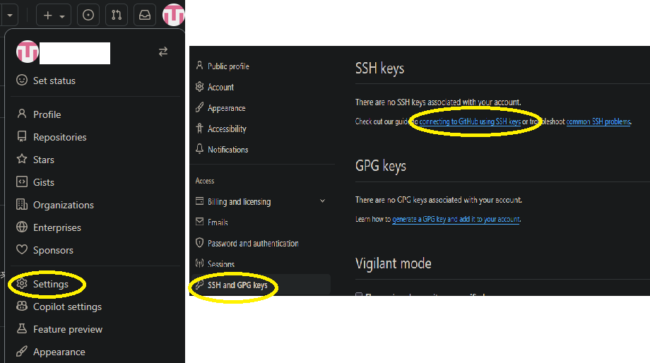
[Enlace a la documentación oficial](https://docs.github.com/es/authentication/connecting-to-github-with-ssh/generating-a-new-ssh-key-and-adding-it-to-the-ssh-agent)

## Resumen Paso a paso

1. Generar una clave

   Desde la terminal de GitBash:

   ```bash
   ssh-keygen -t ed25519 -C "your_email@example.com"
   ```

   Nos dará la opcion de crear una frase de seguridad (se puede dejar en blanco dandole a intro)

   Deberia salir algo similar a esto:
   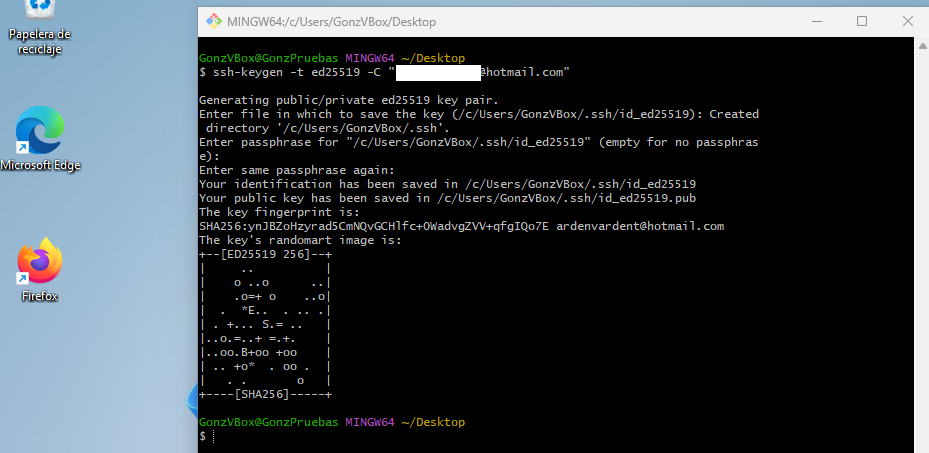

2. Ubicación de la clave

   En nuestra carpeta de usuario ("C:\\Users\\TuNombreUsuario") se debe haber creado una carpeta llamada .ssh

   Nota: Se debe habilitar en el panel superior "Ver", la visualización de archivos ocultos y extensiones de archivos

   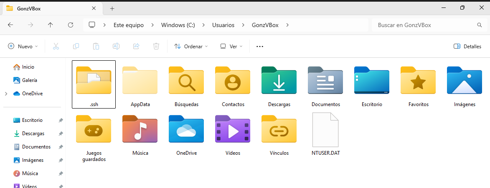

   Podemos (y deberíamos) editar el nombre, para identificar el PC casa y PC FP

   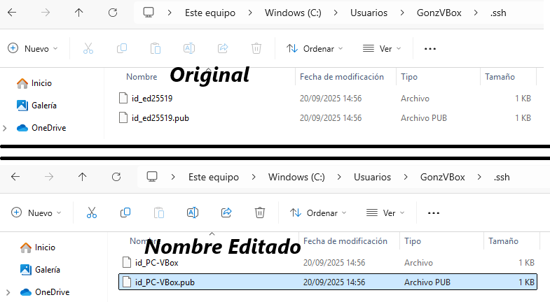

3. Copiar auto-encendido

   Ahora, falta decirle a la terminal de GitBash, que clave usar

   1. Copiar ficheros en carpeta de usuario

      [Copiar todo en carpeta TuUsuario](./Copiar%20en%20carpeta%20de%20usuario/)

      Solo se requiere un fichero `.bashrc`, en caso de Windows ese mismo, y en caso de Linux `.bashrcLINUX`, tan solo borrar "Linux" del nombre.

   2. Copiar ficheros en carpeta .ssh

      [Copiar todo en carpeta .ssh](./Copiar%20en%20carpeta%20.ssh/)

   Debería quedar así (es posible que haya más cosas en la carpeta personal, eso es debido a que esta es una Maquina Virtual creada para esto y totalmente limpia)

   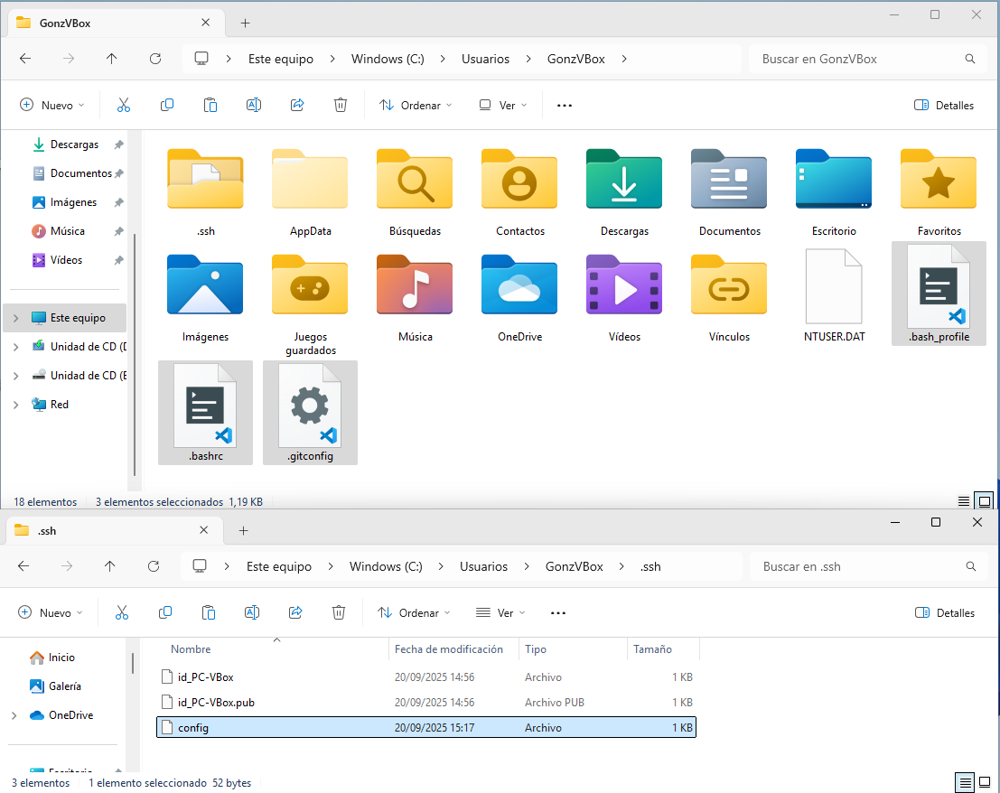

4. Editar ficheros copiados

   1. En la carpeta de usuario, editamos 2 de 3. Editamos ".gitconfig" y ".bashrc"

      - .gitconfig

        En este tenemos que editar las primeras lineas con nuestros datos (usuarioCuenta, correoCuenta, nombreDispositivo)

      - .bashrc

        En este tenemos que editar las líneas 16 y 18, con el nombre que le hayamos puesto a nuestra clave (en este caso de ejemplo: id_PC-VBox)

      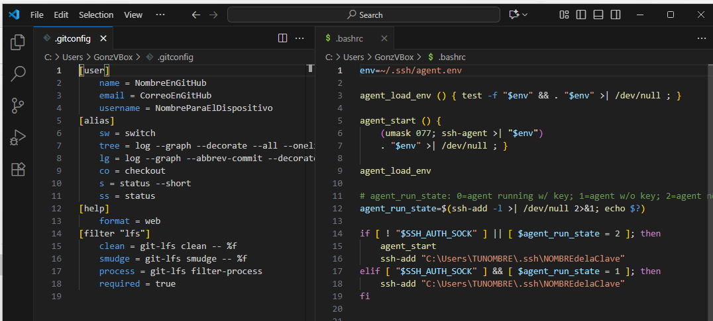

      Y tambien hay que editar en esas líneas, el nombre de usuario

      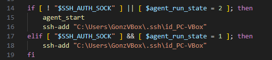

      En caso de LINUX, solo hay que editar el nombre de la clave, la ruta de usuario se asume/lee con `$HOME` sin tener que cambiarlo

   2. En la carpeta .ssh, editamos el fichero config

      Igual que en el caso anterior, ponemos el nombre utilizado para la clave

      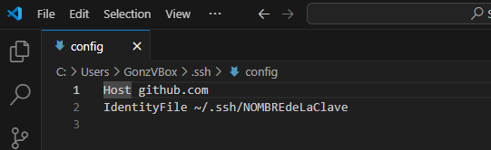

5. Agregamos la clave publica a GitHub

   En la sección de GitHub => Configuración => SSH and GPG keys; pulsamos en "Agregar Clave SSH"

   Abrimos y pegamos todo el contenido de la clave pública (el que acaba en .pub)

   Esto incluye un correo, que he borrado en la imagen

   ESTOS DATOS SON SENSIBLES, procurar no subirlos de forma pública a ningun lado (como esto que estoy haciendo), en mi caso, estoy usando una cuenta solo para esto y desde una maquina virtual.

   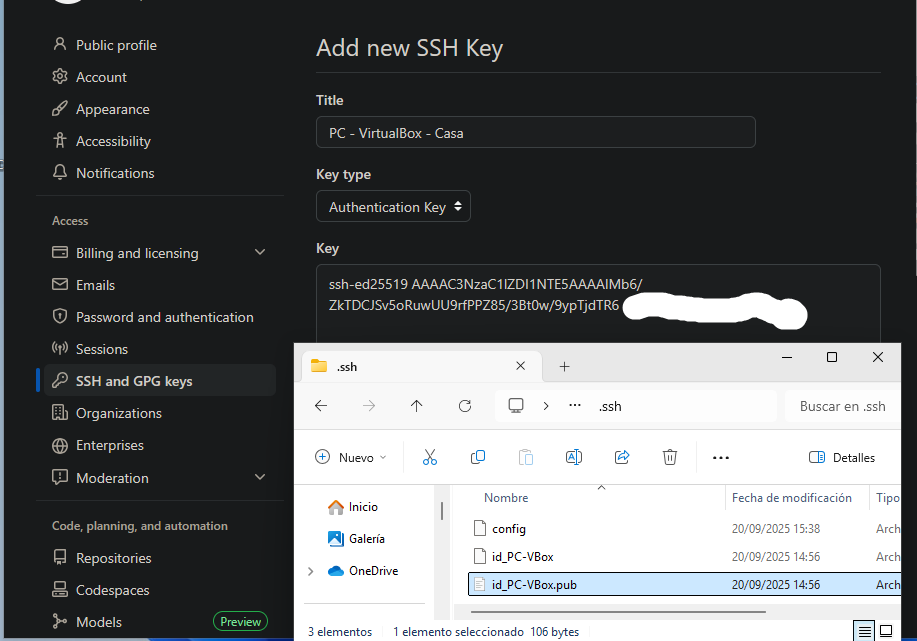

6. Conectamos con GitHub

   Para verificar la conexión ssh, introduccimos el siguiente comando en GitBash (en una terminal nueva para que cargue la Id)

   ```bash
    ssh -T git@github.com
   ```

   La 1ª vez nos da un error, y cuando pregunte, escribimos "yes" (sin comillas)

   Esto agregará a GitHub como receptor de protocolos ssh

   Si volvemos a escribir el mismo comando, ya nos saluda directamente sin errores

   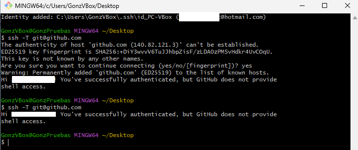

## Conclusión

Con esto, nuestrastras terminales gitbash, podran conectarse con nuestros repositorios privados

Esto debemos complementarlos en VS tambien, identificandonos con el mismo correo que en GitHub

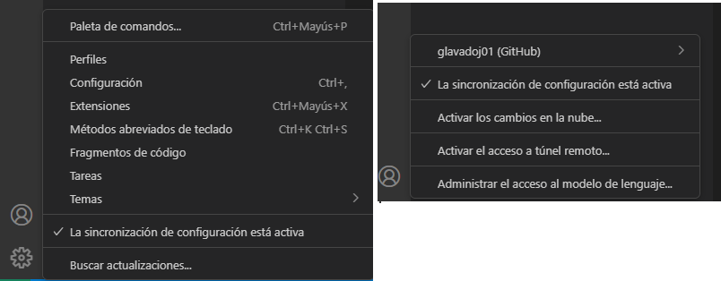
