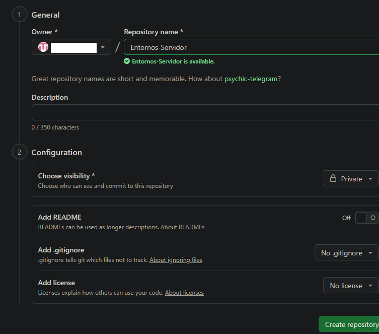
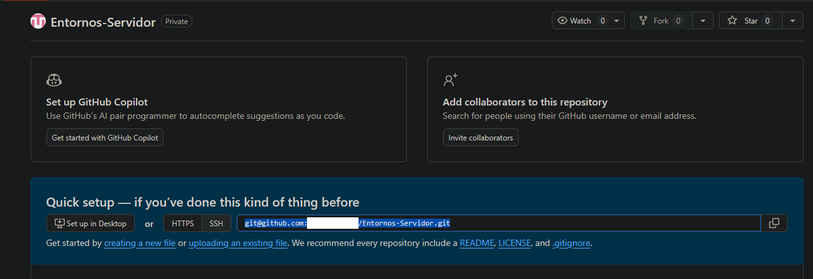
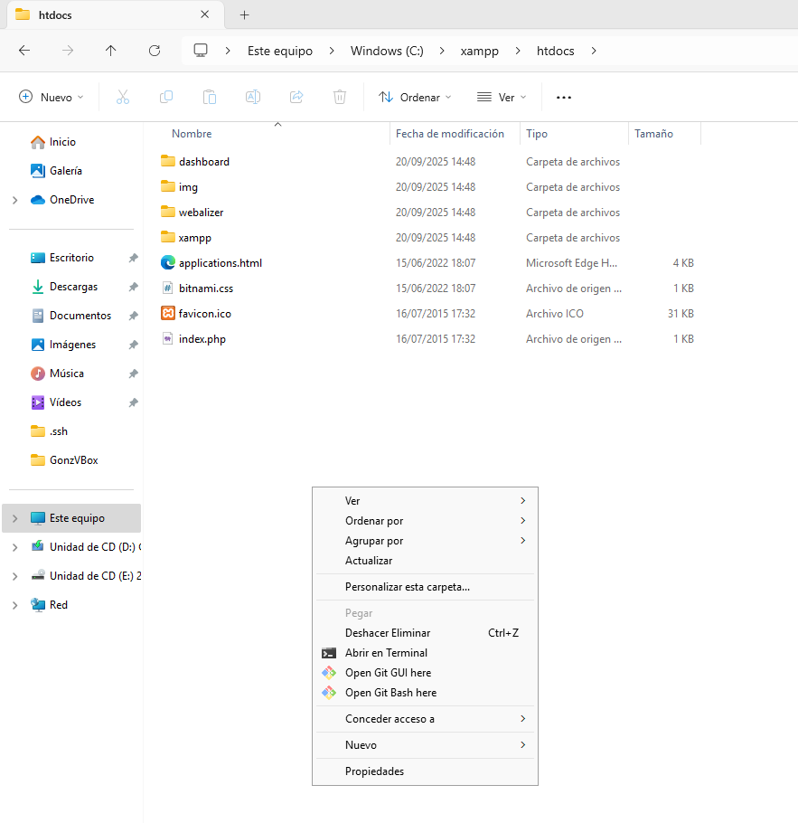
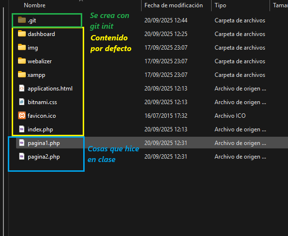
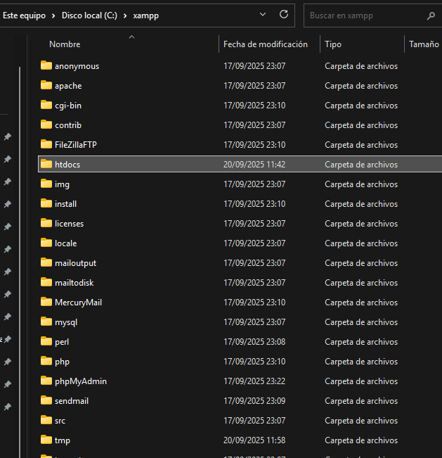
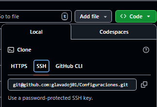

# Sincronizar una carpeta con contenido

En este caso, es posible que ahora mismo tengamos ya cosas en uno o dos pc, entonces, vamos a tener cuidado para no perder nada en ninguno.

## 1º En GitHub

Creamos un repositorio privado (NombreSinEspacios)



Selecionamos y copiamos el enlace de acceso ssh



## Primer PC

Si nos ubicamos en la carpeta de trabajo del XAMPP ("C:\\xampp\\htdocs"), podemos abrir ahi directamente la terminal GitBash (más opciones => Open GitBash Here)



Introduccimos los siguientes commandos

Inicia el repositorio local

```bash
git init
```

Lo asocia con el repositorio remoto

```bash
git remote add origin ENLACE_COPIADO
```

NOTA: Cuidado al pegar que si no esta bien configurada la terminal, le agrega elementos a lo que copias y no funcionará. Lo mejor es con click derecho

Agrega todo al área de guardado (stage area)

```bash
git add .
```

Nota: Olvidaros de las advertencias, es "normal"

Hacemos commit y push

```bash
git commit -m "Primer Commit"
```

```bash
git push -u origin main
```

Nota: el "menos u", significa que este sera el push por defecto. Las próximas veces solo hara falta escribir "git push"

## Segundo PC

Da igual si el 1º es "casa" o es "clase". Si vuelco lo que ya he subido a GitHub, borraré lo que hay en este.

No pasa nada, solucion simple: Saca los 2 o 3 archivos Prueba que has hecho y tienes ahí.

En mi caso: pagina1.php y pagina2.php => Los Corto y Pego en el escritorio "pa mientras"



Borramos la carpeta "htdocs" al completo



Abrimos la terminal de GitBash aquí y clonamos el repositorio privado.

```bash
git clone LinkSSH
```



Finalmente, vuelve a guardar lo que dejamos en el escritorio y ya puedes hacer commit y push.

Y antes de que se nos olvide; en el PC, la carpeta se tiene que llamar de nuevo htdocs, F2 y le cambiamos el nombre. No pasa nada por que en el pc se llame de una manera (htdocs) y en GitHub de otra (Entornos-Servidor).

## Conclusión

Con esto, tendras enlazado en un solo repositorio, las carpetas de trabajo para el servidor XAMPP, tanto en casa, como en clase, como en el pc que gustes. Solo ten cuidado con tus claves.

Tan solo hay que recordar hacer push/pull siempre.
