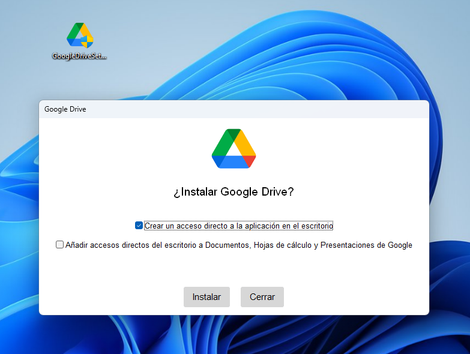
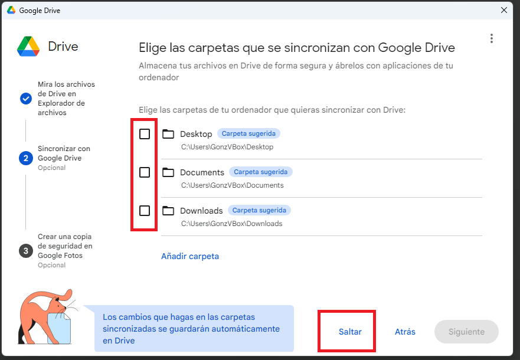

# Sincronizar Trabajo diario en Nube Personal

Este método automático lo podremos utilizar en la mayoría del trabajo de clase.

No se recomienda para un futuro, cuando un proyecto/carpeta empiece a requerir de la instalación de multiples librerias (tipo npm, ya llegaremos, por ahora vale)

Tampoco lo podemos usar para carpetas que forzosamente deban estar en un lugar concreto (como en la asignatura de Servidor, que por ahora, debe estar en C:\\xampp\htdocs "sí o sí")

En mi caso, al usar un correo @hotmail, utilizo la nube de microsoft (OneDrive). Entiendo que la mayoría utiliza un correo @google o el escolar @suarez.
Aquí voy a usar el @suarez para la guia.

## 1. Instalar la app de escritorio de Nuestra Nube

Si utilizamos el del IES, perfe. Si utilizamos uno personal de google, tan solo cuidado de no sincronizar todo-todo, que podemos petar el pc de clase con fotos y tal... Nada explota ni nada se estropea, pero es más coñazo.

[Descarga Drive Aquí](https://dl.google.com/drive-file-stream/GoogleDriveSetup.exe)

¡Importante!

Marcar el acceso en escritorio (el de acceso a doc, calculo,... Al gusto de cada)

Instalar y lanzar

## 2. Iniciar Sesión

Si seguimos el instalador, se nos abrira el navegador y nos pedira las credenciales (correo y contraseña)

## 3. No sincronizar carpetas de este pc

A ver, aquí esta la clave y lo que el 90% hace mal.

Explicación mal:

Instalo esto en casa, sincronizo cosas. Instalo esto en clase, sincronizo cosas.

Así tengo, 2 carpetas diferentes para cada cosa. Y tienes que acordarte que esta en casa, que esta en clase;..., subirlas/bajarlas tú..., un jaleo!

Solución: No sincronices carpetas del PC y Saltar

## 4. Unificar todo en un solo lugar

Ahora mismo, tenemos "cosas" independientes en 2 PCs.

Vamos a crear una "carpeta Nube" mediante "replicar", la llamamos "Carpeta FP" o algún nombre así identificativo. Y tan solo hay que meter todo lo que tengamos en este pc ahi. Tan facil como eso, simplemente guardar las cosas en un sitio especifico.

<video width="600" height="400" controls>
  <source src="./.img/Configuración Drive.mp4" type="video/mp4">
  Tu navegador no soporta el elemento video.
</video>

Este proceso lo repetimos en casa y clase, y tendremos la misma carpeta con el mismo contenido en cualquier pc sin tener que acordarte de hacer nada. Ya funciona solo. 🥳
